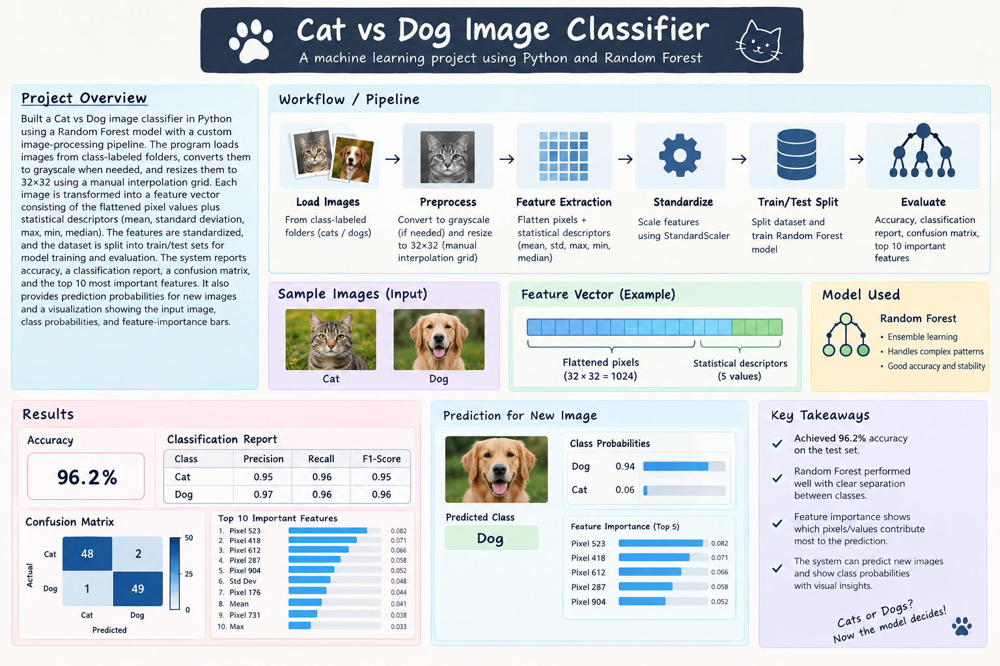
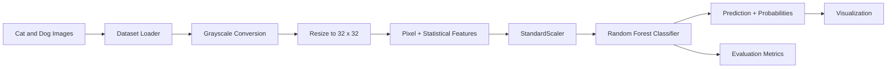

# Cat and Dog Image Classification

<div align="center">
  
</div>

<p align="center">
  
  
  
</p>

A classical machine-learning project that classifies images as cats or dogs using image preprocessing, handcrafted pixel features, feature scaling, and a Random Forest classifier.

## Overview

The application reads labeled images from class-specific folders, converts images to grayscale, resizes them to a consistent `32 × 32` format, extracts pixel and statistical features, and trains a Random Forest model for classification.

The project also reports evaluation results and can visualize the input image, prediction probabilities, and the model's most important features.

## System Architecture



## Key Features

- Loads images from class-based directories
- Supports PNG, JPG, and JPEG image files
- Converts color images to grayscale
- Resizes images to a consistent `32 × 32` resolution
- Extracts flattened pixels and summary statistics
- Uses `StandardScaler` for feature normalization
- Trains a configurable Random Forest classifier
- Generates accuracy, classification report, and confusion matrix
- Predicts class probabilities for individual images
- Visualizes predictions and feature importance

## Machine Learning Workflow

1. Organize images into labeled folders.
2. Load and preprocess each image.
3. Convert images to grayscale and resize them.
4. Extract pixel-level and statistical features.
5. Split the dataset into training and test sets.
6. Scale the features using `StandardScaler`.
7. Train the Random Forest classifier.
8. Evaluate the model on the test set.
9. Predict and visualize results for new images.

## Repository Structure

```text
Cat-dog-image-classification/
├── README.md
├── LICENSE
├── requirements.txt
├── catDogClassification.png
├── cat dog image classifier.py
├── docs/
│   └── README.md
└── src/
    └── README.md
```

## Dataset Structure

The training directory should contain one folder per class:

```text
training_data/
├── cats/
│   ├── cat_001.jpg
│   ├── cat_002.jpg
│   └── ...
└── dogs/
    ├── dog_001.jpg
    ├── dog_002.jpg
    └── ...
```

The folder names become the model labels, so you can use `cats` and `dogs` or other consistent class names.

## Getting Started

### Prerequisites

- Python 3.x
- A labeled cat-and-dog image dataset
- A test image for prediction

### Install dependencies

```bash
pip install -r requirements.txt
```

### Configure paths

Open `cat dog image classifier.py` and update the paths in `main()`:

```python
training_folder = "path/to/training/data"
test_image = "path/to/test/image.jpg"
```

### Run the classifier

```bash
python "cat dog image classifier.py"
```

## Model Configuration

The example application initializes the model with:

```python
classifier = ImageRandomForestClassifier(
    n_estimators=100,
    max_depth=10
)
```

You can adjust `n_estimators` and `max_depth` to experiment with model capacity and performance.

## Evaluation Output

After training, the program reports:

- Test accuracy
- Classification report
- Confusion matrix
- Top 10 feature-importance values
- Predicted class for the test image
- Class probability estimates

The visualization displays the input image, classification probabilities, and the most important model features.

## Limitations

- The model uses handcrafted grayscale pixel features rather than a deep neural network.
- Image quality, lighting, pose, and background can affect predictions.
- The example requires users to provide their own dataset and image paths.
- A balanced and sufficiently large dataset is recommended for meaningful evaluation.

## Future Improvements

- Add automated dataset downloads and validation
- Use data augmentation for better generalization
- Compare Random Forest with SVM and CNN models
- Add a train/test command-line interface
- Save and load trained models
- Add precision, recall, F1-score, and confusion-matrix plots
- Create a web or desktop interface for image uploads

## License

This project is licensed under the MIT License. See the `LICENSE` file for details.

---

<p align="center">
  <strong>Built for computer vision learning, classical machine learning, and image classification experimentation.</strong>
</p>
